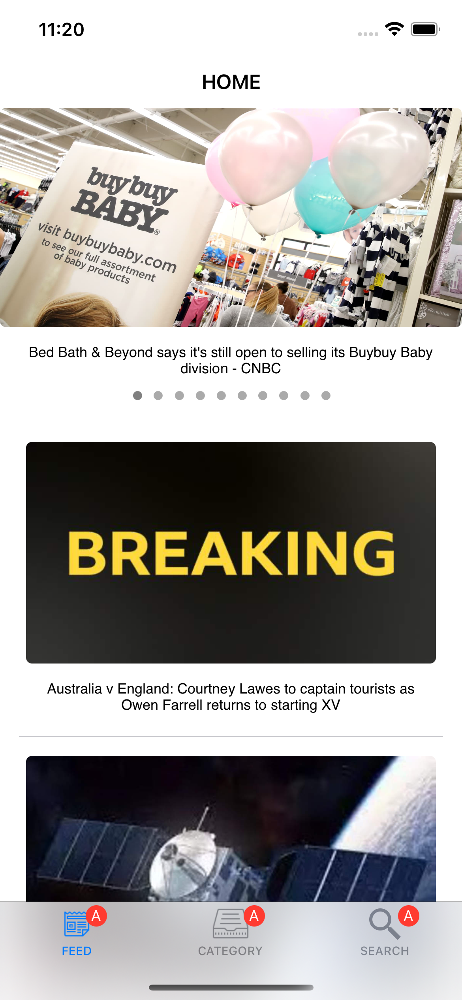
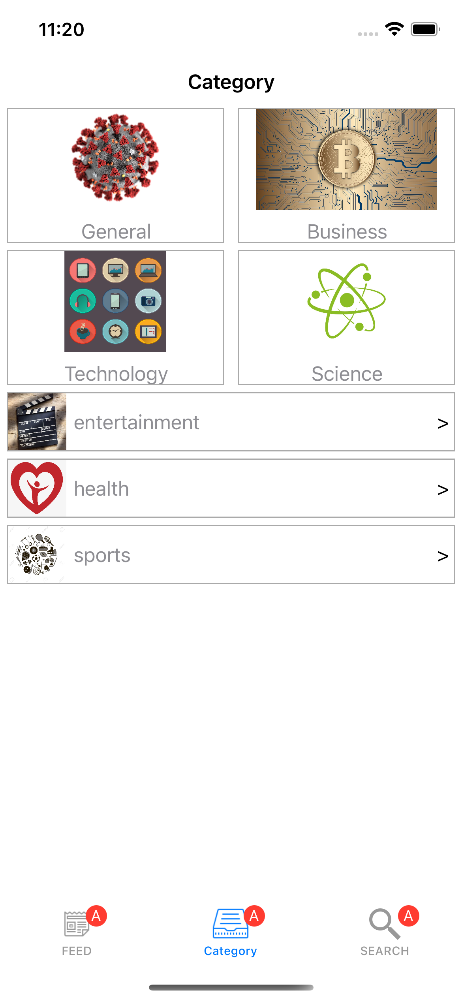
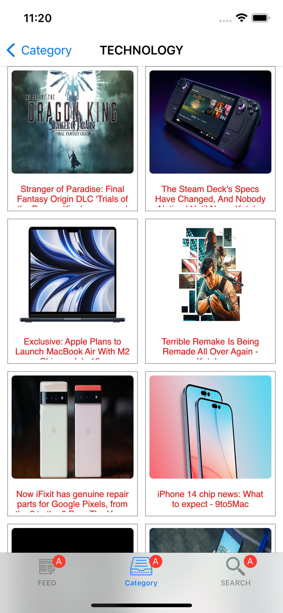

# NewsApp
News application which you can read daily news and categorize. Apps architecture is MVVM(Delegation).

# TODOS
- Implements new network service with RxSwift
- Change all pages with MVVM architecture(Home Page Completed)
- Add functional programming with RxSwift feature to all pages 
- ReLayout with Snapkit
- Complete Search Page

# Feature
- Programmatically UI
- Custom views and layouts
- Nested collection views.

# 3rd Party Libraries
- SDWebImage
- RxSwift(will be added later)
- Snapkit

# ScreenShots
  

# License
MIT
